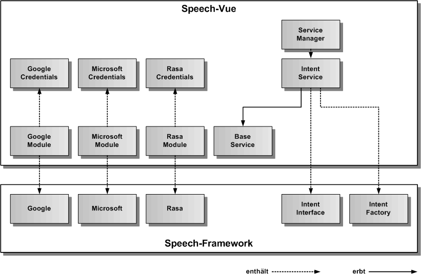
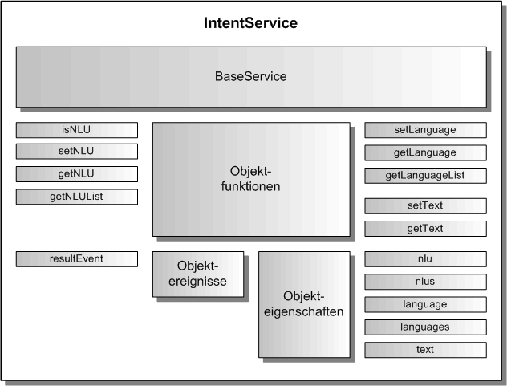

# IntentService

Der IntentService dient zur Sprachanalyse von Texten zur Erzeugung eines Intents. Für die Sprachanalyse wird die NLU des Google Cloud-Dienstes verwendet. Der intentService erbt vom abstrakten [BaseService](./../base/BaseService.md).

## Architektur

In der folgenden Grafik werden die einzelnen Schichten, angefangen von der VueApp, über den ServiceManager, den IntentService, den GoogleService und das GoogleModule von Speech-Vue, die Intent-Komponente, das Plugin für die NLU (Natural Language Understanding), sowie die verschiedenen Cloud-Komponenten im Speech-Framework, bis hinunter zum Cloud-Dienst, dargestellt. 

Ganz oben sind die für den IntentService notwendigen Google-Credentials dargestellt, die der VueApp übergeben werden müssen. Eine Anleitung für die Erstellung der Credentials und die Einbindung der Cloud-Module in die VueApp zur Aktivierung des jeweiligen Cloud-Service findet man unter [docs/cloud/Cloud.md](./../../cloud/Cloud.md)

Die nächste Grafik zeigt die konkrete Vererbungsbeziehung zu BaseService, sowie die Einbindung von IntentFactory und IntentInterface aus dem Speech-Framework. IntentFactory ist eine statische Klasse und erzeugt das Intent-Objekt zum IntentInterface. Auf der linken Seite sind die verschiedenen Cloud-Module dargestellt, welche als statische Klassen implementiert sind und das jeweilige Cloud-Singleton (Google, Microsoft und Rasa) aus dem Speech-Framework einbinden.
Damit die Cloud-Dienste funktionieren, müssen die Credentials vom jeweiligen Cloud-Module an das Cloud-Singleton weitergereicht werden.

## API

Der IntentService definiert die öffentliche Schnittstelle von Speech-Vue für die Sprachanalyse. Die folgende Grafik zeigt einen Überblick über die gesamte API des IntentServices. Die API teilt sich auf in Objektfunktionen, Objektereignisse und Objekteigenschaften. Die API verfügt über eine auf Funktionen und eine auf Eigenschaften basierende Schnittstelle. Die gleiche Aufgabe kann über Funktionsaufrufe oder über das Setzen von Eigenschaften erledigt werden. Z.B. kann die Sprache entweder mit intentService.setLanguage('de') oder mit intentService.language = 'de' eingetragen werden, bevor mit intentService.start() die Sprachanalyse gestartet wird.

## Importieren

Um den IntentService importieren zu können, muss in der jeweiligen Komponente folgende Zeile eingefügt werden:

	import { SPEECH_INTENT_SERVICE, ServiceManager, IntentService } from 'speech-vue'

Dazu müssen das Speech-Framework und das Speech-Vue npm-Paket in der gleichen Version vorher ins eigene VueApp-Projekt kopiert und installiert worden sein.

	$ npm install speech-framework-<version>.tgz
	$ npm install speech-vue-<version>.tgz
	 
Alternativ kann man Speech-React aus dem globalen NPM-Repository installieren. Dann wird Speech-Framework automatisch mitinstalliert.

	$ npm install speech-react
	

## Konfiguration

Dier erste Aufgabe vor Nutzung des IntentService besteht in der Festlegung der Konfiguration vor der Erzeugung des Services in Vue. In der Defaulteinstellung wird die init()-Funktion im Konstruktor aufgerufen und die voreingestellte Konfiguration übernommen. Will man die Defaultkonfiguration überschreiben, holt man sie sich mittels der Klassenfunktion IntentService.getConfig(). Diese Funktion gibt das IntentConfig-Objekt des IntentServices zurück.

Auszug aus der Datei: src/speech/intent/intent-service-config.ts:

	// hier sind die Defaultwerte des IntentService festgelegt	
	export const IntentServiceConfig: IntentServiceOptionInterface = {
	    /** ein/ausschalten der Intent-Komponente */
	    activeFlag: true,
	    /** setzt die Sprache fuer die Sprachanalyse ( 'de', 'en' )*/
	    intentLanguage: 'de',
	    /** legt fest, ob die Fehlermeldungen zusaetzlich auf der Konsole ausgegeben werden */
	    errorOutputFlag: false
	};

## Sprachanalyse

Um Sprache zu analysieren, muss zuerst die Sprache festgelegt werden. Hier hat man die Wahl zwischen den Funktionen zum Eintragen der Werte, oder den Eigenschaften. Die Sprache kann auch in der Konfiguration mit dem Parameter intentLanguage eingetragen werden. Es gibt zwei Konstanten für die Sprache Deutsch ('de') und Englisch ('en'), die immer verwendet werden sollten, wenn man die Sprache eintragen will. Neben der Sprache muss auch der Text für die Sprachanaylse übergeben werden. Dies kann man entweder mit der Übergabe des Textes an die intentService.setText() Funktion oder mit der Zuweisung an intentService.text machen. Hat man diese Werte eingetragen kann man die Sprachanalyse mit intentService.start() beginnen und mit intentService.stop() abbrechen. Nach dem Start der Sprachanalyse erhält man das Ereignis resultEvent und die Sprachanalyse wird automatisch beendet. Das Ereignis resultEvent erhält die Intention und die Confidence für den übergebenen Text. Falls ein Fehler auftritt, erhält man das Ereignis errorEvent.

Beispiel-Komponente für die Integration von Sprache:

 	<template>
		

			<button @click="intentGerman('Dies ist ein Testintent')">
				Intent starten
			</button>
			<button @click="intentStop()">
				Intent stoppen
			</button>
		

	</template>

	
